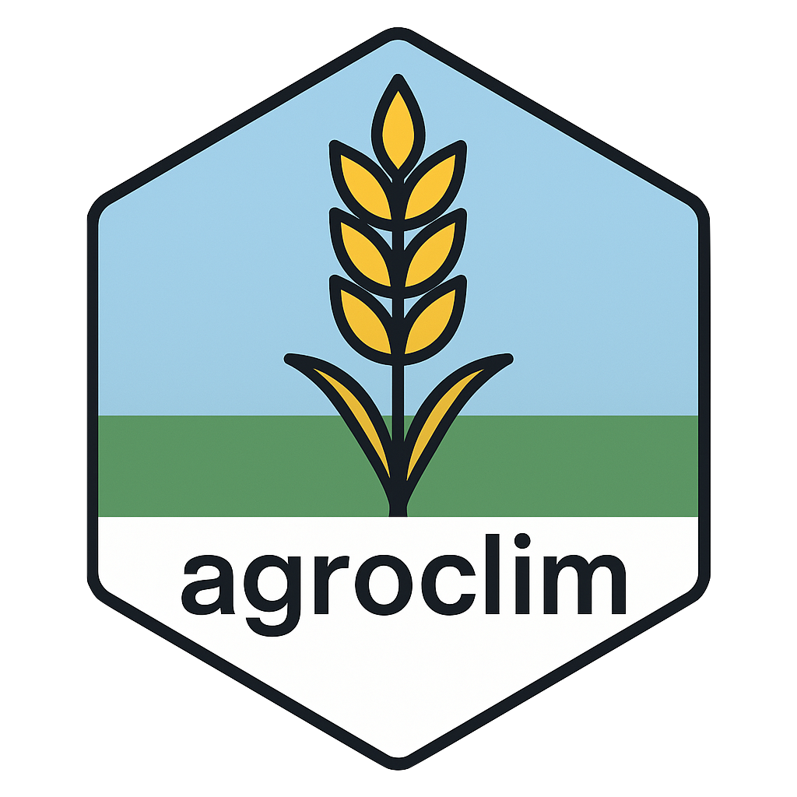

# <p align="center">
  
</p>
 agroclim

[](https://opensource.org/licenses/MIT)
[](https://github.com/sbegueria/agroclim/issues)
[](https://github.com/sbegueria/agroclim/stargazers)

**Climatic Indices for Agriculture**

**agroclim** is an R package for computing a wide range of agroclimatic indices from daily climate data.
These indices are useful for applications in agronomy, phenology, and climate impact research.

Inspired by the need to support agroclimatic research with flexible and reproducible tools.

## Installation

You can install the development version of **agroclim** from GitHub using:

```r
# install.packages("devtools")
devtools::install_github("sbegueria/agroclim")
```

## Usage

```r
library(agroclim)

# Example: Calculate growing degree days (GDD)
gdd <- gdd(tmin = min_temps, tmax = max_temps, base_temp = 10)
```

## Available Indices

| Function         | Description                                                   |
|------------------|---------------------------------------------------------------|
| `bedd`           | Biologically effective degree days                            |
| `coldMonth`      | Number of cold months per year                                |
| `ehe`            | Excess heat events                                            |
| `firstFrost`     | Date of first frost event                                     |
| `firstTemp`      | Date of first threshold exceedance in spring                  |
| `frostDays`      | Number of frost days                                          |
| `frostFreqs`     | Frequency of frost events                                     |
| `frostProb`      | Probability of frost based on historical data                 |
| `gdd`            | Growing degree days                                           |
| `gst`            | Growing season temperature                                    |
| `hi`             | Huglin index (viticulture)                                    |
| `lastFrost`      | Date of last frost event                                      |
| `tempDayprob`    | Daily temperature exceedance probability                      |
| `tempProb`       | Temperature threshold exceedance probability                  |
| `warmMonth`      | Number of warm months per year                                |

## Auxiliary functions

| Function         | Description                                                   |
|------------------|---------------------------------------------------------------|
| `calcGrid`       | Apply index calculations to gridded data                      |
| `pentadProbs`    | Probability calculations over 5-day intervals (pentads)       |

## Data

The package includes sample datasets and functions to extract and process gridded climate data.

## Contributing

Contributions are welcome! Feel free to fork the repository, create issues, or submit pull requests.

## License

This package is licensed under the [MIT License](LICENSE).

## Acknowledgments

Developed by Roberto Serrano-Notivoli and Santiago Beguería, and maintained by S. Beguería and contributors.
